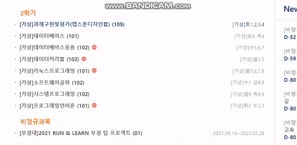

<h1>Hello, This Project is pk_selecter</h1>
<h6> 이런 경험 있지 않나요? </h6>

  

<h2> 로그인만하세요 </h2>
 <h6>
     PKSelct가 수업 관련 정보 모아서 보여줄게요. 
</h6>

위에 처럼 움짤넣기 깃북도 추가하기 
https://doongu.gitbook.io/pk_select/

   
<h2> 어떻게 만들었나요? </h2>
<h6>
    컴퓨터공학과 4명에서 만들었어요. 비대면이 끝나면 이 프로젝트도 사라지겠지만 그 전에 열심히 해볼게요 !
</h6>
 
</a> </a>&nbsp </a> </a>&nbsp

   

<h2> 개인정보가 유출 되나요? </h2>
<h6>
    https로 네트워크시 전달되는 데이터가 암호화되어져요 ! 그리고 저희는 DB에 저장하지 않고 단순히 조회만 하고 끝내요 !
</h6>
  

<h2> Team Information </h2>

<!--  아래는 Team INFORMATION 표-->

 <table>
<thead>
<tr>
<th style="text-align:left">Team</th>
<th style="text-align:left">Name</th>
<th style="text-align:left">Position</th>
<th style="text-align:left">E-Mail</th>
<th style="text-align:left">Github</th>
</tr> 
</thead>
<tbody>
<tr>
<td style="text-align:left">Leader</td>
<td style="text-align:left">한준규</td>
<td style="text-align:left">Project Manager, BackEnd Develope</td>
<td style="text-align:left">must1080@naver.com</td>
<td style="text-align:left"></td> 
</tr>
     <tr>
<td style="text-align:left">Team</td>
<td style="text-align:left">오하람</td>
<td style="text-align:left">Project Sub Manager</td>
<td style="text-align:left">5gkfka5@naver.com</td>
<td style="text-align:left"></td>
</tr>
<tr>
<td style="text-align:left">Team</td>
<td style="text-align:left">이가은</td>
<td style="text-align:left">Frontend Develope</td>
<td style="text-align:left">rriver2@naver.com</td>
<td style="text-align:left"></td>
</tr>
 <tr>
<td style="text-align:left">Team</td>
<td style="text-align:left">박민서</td>
<td style="text-align:left">Frontend Develope</td>
<td style="text-align:left">maphchbiea78@gmail.com</td>
<td style="text-align:left"></td>
</tr>
</tbody>
</table>

  

